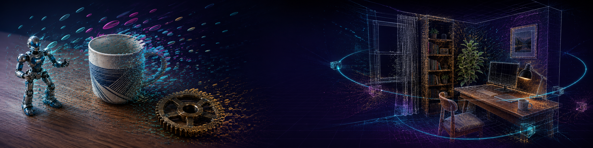
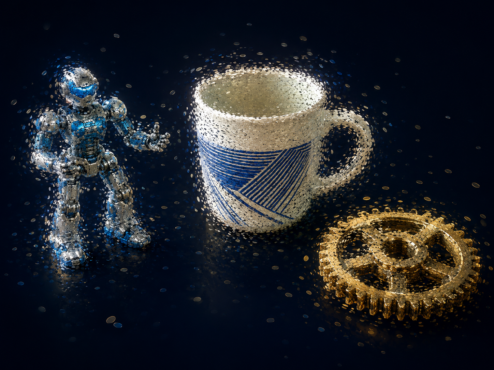
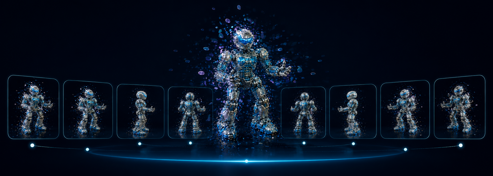
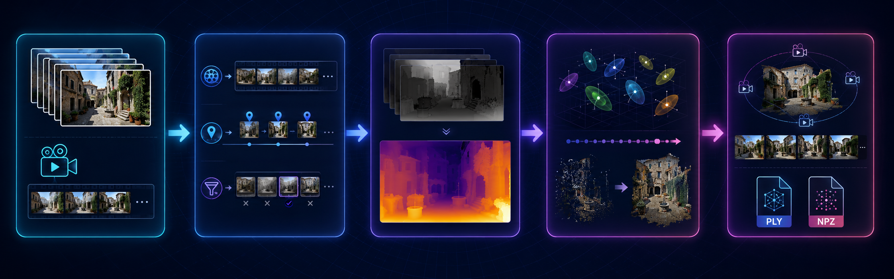
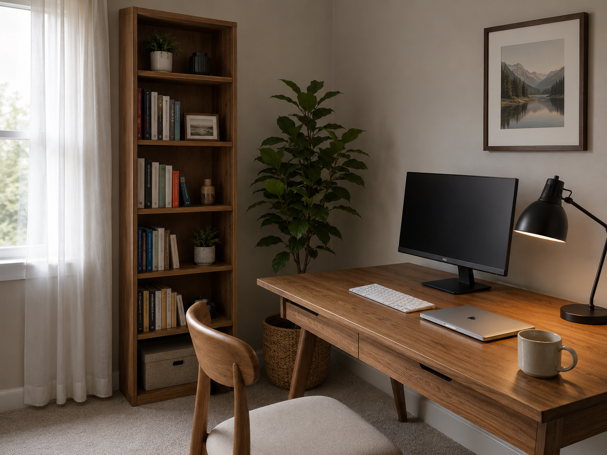
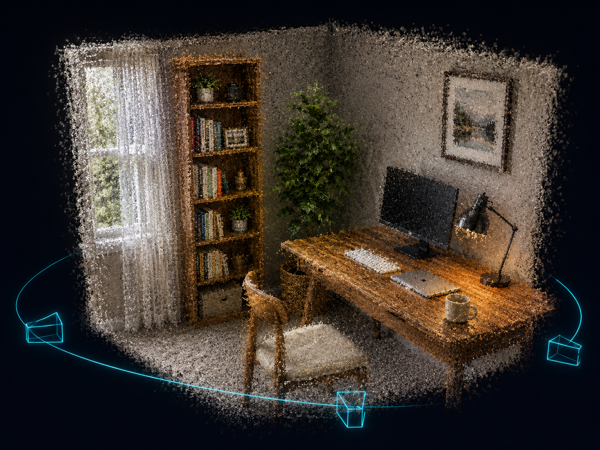

<div align="center">

<!-- Banner Placeholder / 横幅占位符 -->


# 🔮 GaussianScan-Recon

### *3D Gaussian Splatting Pipeline for Object Scanning &amp; Scene Reconstruction*

<p align="center">
  <strong>From images or monocular video to explorable 3D scenes — modular, practical, production-ready.</strong><br>
  A complete 3DGS pipeline with frame extraction, depth estimation, Gaussian modeling, and visualization export.
</p>

[](https://opensource.org/licenses/MIT)
[](https://www.python.org/downloads/)
[](https://developer.nvidia.com/cuda-toolkit)
[](https://repo-sam.inria.fr/fungraph/3d-gaussian-splatting/)

**English** | [简体中文](#-what-is-gaussianscan-recon--这是什么)

</div>

---

## 📖 What is GaussianScan-Recon? / 这是什么？

**GaussianScan-Recon** 是一个基于 **3D Gaussian Splatting (3DGS)** 的开源项目，专注于从图像或单目视频中重建三维场景。项目提供了完整的模块化流水线——从视频抽帧、深度估计、Gaussian 建模到可视化导出——既可以作为学习 3DGS 的起点，也可以作为课程设计、毕业设计的完整框架。

**GaussianScan-Recon** is an open-source project based on 3D Gaussian Splatting, focused on reconstructing 3D scenes from images or monocular video. It provides a complete modular pipeline — from frame extraction and depth estimation to Gaussian modeling and visualization — suitable for learning 3DGS, course projects, and further research.

<div align="center">
<!-- Demo Placeholder / 演示占位符 -->



<br/>
<em>Input images (left) → 3D Gaussian reconstruction (center) → Novel orbit view (right)</em>
<br/>
<em>输入图片（左）→ 三维高斯重建（中）→ 环绕新视角（右）</em>
</div>

---

## ✨ Core Highlights / 核心亮点

<table>
<tr>
<td width="50%">

### 🎯 **Multi-Input Support / 多输入支持**
支持**多视角图片**和**单目视频**两种输入模式。无需多相机阵列，一部手机即可采集数据。

### ⚡ **Modular Pipeline / 模块化流水线**
抽帧 → 深度估计 → Gaussian 建模 → 渲染导出，每一步都是独立可替换的模块。清晰接口，方便二次开发。

### 🔧 **Mock Training / 模拟训练**
内置完整的模拟训练流程，无需 CUDA GPU 即可跑通全链路，验证代码正确性。真实训练接口已预留，可无缝切换。

### 📦 **Rich Export / 丰富导出**
支持 **PLY**（二进制）和 **NPZ**（压缩数组）两种格式导出，兼容 CloudCompare、MeshLab、Blender 等主流工具。

</td>
<td width="50%">

### 🎯 **多输入支持**
Supports **multi-view images** and **monocular video**. No multi-camera rig needed — capture with just a smartphone.

### ⚡ **模块化流水线**
Frame extraction → depth estimation → Gaussian modeling → rendering. Each step is an independent, replaceable module with clear interfaces.

### 🔧 **模拟训练**
Built-in mock training pipeline runs end-to-end without a CUDA GPU, verifying code correctness. Real training interface is reserved for seamless upgrade.

### 📦 **丰富导出**
Export to **PLY** (binary) and **NPZ** (compressed) formats, compatible with CloudCompare, MeshLab, Blender, and more.

</td>
</tr>
</table>

---

## 📑 Table of Contents / 目录

- [Pipeline Overview / 流程概览](#-pipeline-overview--流程概览)
- [Project Structure / 项目结构](#-project-structure--项目结构)
- [Installation / 安装](#-installation--安装)
- [Quick Start / 快速开始](#-quick-start--快速开始)
- [Usage / 使用说明](#-usage--使用说明)
- [Configuration / 配置文件](#-configuration--配置文件)
- [Results / 效果展示](#-results--效果展示)
- [Roadmap / 后续计划](#-roadmap--后续计划)
- [FAQ / 常见问题](#-faq--常见问题)
- [Citation / 引用](#-citation--引用)
- [License / 许可证](#-license--许可证)

---

## 🔄 Pipeline Overview / 流程概览

<div align="center">

<!-- Pipeline Diagram Placeholder / 流程图占位符 -->


</div>

| Step 步骤 | Script 脚本 | Description 说明 |
|:---------:|-------------|------------------|
| **1. Preprocess** | `scripts/preprocess.py` | Extract & filter keyframes from video/images. 从视频/图片中提取和过滤关键帧。 |
| **2. Depth Estimation** | `scripts/estimate_depth.py` | Monocular depth estimation (mock / Depth Anything V2 ready). 单目深度估计（Mock 模式 / 预留 Depth Anything V2 接口）。 |
| **3. Training** | `scripts/train_mock.py` | 3D Gaussian Splatting training (mock for demo, CUDA ready). 3D 高斯泼溅训练（模拟训练可演示，真实训练接口已预留）。 |
| **4. Visualization** | `scripts/visualize.py` | Multi-view rendering, 3D scatter, HTML preview. 多视角渲染、3D 散点图、HTML 交互预览。 |

---

## 📁 Project Structure / 项目结构

```
GaussianScan-Recon/
├── README.md                          # 项目说明（你在这里）
├── LICENSE                            # MIT 许可证
├── requirements.txt                   # Python 依赖
├── pyproject.toml                     # 项目元数据与构建配置
├── .gitignore
│
├── configs/
│   └── default.yaml                   # 默认配置文件（含完整注释）
│
├── gaussian_scan/                     # 核心库
│   ├── __init__.py                    #   包入口
│   ├── gaussian_model.py              #   GaussianPoint / GaussianCloud 数据结构 + PLY/NPZ I/O
│   ├── camera.py                      #   针孔相机模型 + 轨迹生成
│   ├── dataset.py                     #   图像数据集 + 视频帧提取
│   ├── renderer.py                    #   简化光栅化渲染器（非 CUDA）
│   ├── visualization.py               #   2D/3D 可视化 + HTML 交互预览
│   └── utils.py                       #   图像 I/O、缩放、网格拼接
│
├── scripts/                           # 可执行脚本
│   ├── preprocess.py                  #   Step 1: 预处理（抽帧 / 加载图片 / 生成示例）
│   ├── estimate_depth.py              #   Step 2: 深度估计（Mock / 接口预留）
│   ├── train_mock.py                  #   Step 3: 模拟训练
│   └── visualize.py                   #   Step 4: 可视化与导出
│
├── docs/                              # 文档
│   ├── README.md                      #   详细文档
│   └── images/                        #   图片资源
│       ├── README.md
│       ├── banner.png                 #     项目横幅
│       ├── pipeline.png               #     流程图
│       ├── demo_object_input.png      #     物体扫描输入
│       ├── demo_object_gaussian.png   #     高斯重建效果
│       ├── demo_scene_input.png       #     场景输入
│       ├── demo_scene_reconstruction.png  #  场景重建效果
│       └── orbit_view.png             #     环绕视角
│
├── data/                              # 数据目录
│   ├── README.md
│   └── samples/
│       ├── object_scan/               #   物体扫描示例（放置多视角物体照片）
│       └── room_scene/                #   室内场景示例（放置室内照片）
│
├── outputs/                           # 输出目录
│   └── .gitkeep
│
└── tests/                             # 单元测试
    ├── __init__.py
    ├── test_gaussian_model.py         #   Gaussian 模型测试
    ├── test_preprocess.py             #   预处理测试
    └── test_config.py                 #   配置读取测试
```

---

## 🚀 Installation / 安装

### Prerequisites / 前提条件

| Requirement | Version | Note |
|-------------|---------|------|
| Python | ≥ 3.10 | |
| pip | ≥ 23.0 | |
| CUDA | Optional | 仅真实训练需要，Mock 模式无需 GPU |

### One-Command Setup / 一键安装

```bash
# Clone the repo / 克隆仓库
git clone https://github.com/Laityperfect7/GaussianScan-Recon.git
cd GaussianScan-Recon

# Create virtual environment / 创建虚拟环境
python -m venv venv
source venv/bin/activate        # Linux / macOS
# venv\Scripts\activate         # Windows

# Install dependencies / 安装依赖
pip install -r requirements.txt

# Install in dev mode / 开发模式安装
pip install -e .
```

<details>
<summary>Troubleshooting / 安装问题排查</summary>

- **`open3d` 安装失败**: 尝试 `pip install open3d --no-deps` 然后手动安装 numpy。
- **`cv2` 导入错误**: 确保 `pip install opencv-python-headless` 如果在无头服务器上。
- **权限不足**: 在用户目录下创建 venv 或使用 `--user` 标志。

</details>

---

## ⚡ Quick Start / 快速开始

**一键运行完整流水线（无需 GPU，模拟模式）：**

```bash
# Step 1: 生成示例数据
python scripts/preprocess.py --input DEMO --output outputs/frames --num-demo 10

# Step 2: 模拟深度估计
python scripts/estimate_depth.py --input outputs/frames --output outputs/depth --mode radial

# Step 3: 模拟训练（模拟 3DGS 训练过程）
python scripts/train_mock.py --config configs/default.yaml

# Step 4: 可视化结果
python scripts/visualize.py --checkpoint outputs/checkpoints/mock_model.npz --mode all
```

运行后，查看：
- `outputs/checkpoints/mock_model.npz` — Gaussian 点云 checkpoint
- `outputs/checkpoints/mock_model.ply` — PLY 格式（可用 MeshLab 打开）
- `outputs/renders/orbit_grid.png` — 环绕视角渲染网格
- `outputs/renders/gaussian_scatter.png` — 3D 散点图
- `outputs/renders/preview.html` — 浏览器交互预览
- `outputs/loss_history.json` — 模拟 loss 曲线

---

## 📘 Usage / 使用说明

### Preprocessing Your Own Data / 预处理你自己的数据

```bash
# 从视频提取关键帧
python scripts/preprocess.py \
  --input demo/my_video.mp4 \
  --output outputs/frames \
  --max-frames 200 \
  --blur-threshold 50.0

# 从图片目录加载
python scripts/preprocess.py \
  --input data/samples/object_scan \
  --output outputs/frames

# 生成示例图像（用于测试）
python scripts/preprocess.py \
  --input DEMO \
  --output data/samples/object_scan \
  --num-demo 10
```

### Depth Estimation / 深度估计

```bash
# 三种 Mock 模式
python scripts/estimate_depth.py --input outputs/frames --output outputs/depth --mode radial
python scripts/estimate_depth.py --input outputs/frames --output outputs/depth --mode gradient
python scripts/estimate_depth.py --input outputs/frames --output outputs/depth --mode structured

# 真实使用时替换为：
# python scripts/estimate_depth.py --input ... --model depth-anything-v2
```

### Visualization / 可视化

```bash
# 生成所有可视化
python scripts/visualize.py \
  --checkpoint outputs/checkpoints/mock_model.npz \
  --mode all \
  --num-views 36 \
  --radius 3.0

# 仅生成 3D 散点图
python scripts/visualize.py --mode scatter

# 仅生成环绕视图
python scripts/visualize.py --mode orbit --num-views 48

# 生成 HTML 交互预览
python scripts/visualize.py --mode html
```

### Export / 导出

```python
from gaussian_scan.gaussian_model import GaussianCloud

# 加载 checkpoint
cloud = GaussianCloud.from_npz("outputs/checkpoints/mock_model.npz")

# 导出 PLY（兼容 CloudCompare / MeshLab / Blender）
cloud.export_ply("my_model.ply")

# 导出 NPZ（压缩存档）
cloud.export_npz("my_model.npz")

print(f"点云大小: {len(cloud):,} 个 Gaussian 点")
```

---

## ⚙️ Configuration / 配置文件

```yaml
# configs/default.yaml
scene:
  name: "default"
  type: "object_scan"       # object_scan | room_scene | custom

gaussian:
  num_init: 50000           # 初始 Gaussian 点数
  sh_degree: 3              # 球谐阶数
  scene_bounds: [2.0, 2.0, 2.0]

training:
  iterations: 10000         # 总迭代数
  learning_rate:
    position: 0.00016
    scale: 0.005

visualization:
  orbit:
    radius: 3.0             # 轨道半径
    num_views: 36           # 视角数量
```

完整配置和注释见 [`configs/default.yaml`](configs/default.yaml)。

---

## 🖼️ Results / 效果展示

<div align="center">

### Object Scan / 物体扫描

<table>
<tr>
  <td align="center"><b>Input / 输入</b></td>
  <td align="center"><b>Gaussian Reconstruction / 高斯重建</b></td>
</tr>
<tr>
  <td></td>
  <td></td>
</tr>
</table>

### Scene Reconstruction / 场景复现

<table>
<tr>
  <td align="center"><b>Input / 输入</b></td>
  <td align="center"><b>Reconstruction / 重建效果</b></td>
</tr>
<tr>
  <td></td>
  <td></td>
</tr>
</table>

### Orbit View / 环绕视角

<div>

</div>

</div>

> **⚠️ 说明**: 以上演示图均为示意占位图 (illustrative placeholders)，用于文档展示。真实重建效果需在实际数据上执行 3DGS 训练获得。如已生成真实结果，请替换 `docs/images/` 中的对应文件。
>
> **⚠️ Note**: These demo images are illustrative placeholders for documentation. Real reconstruction results require actual 3DGS training on real data. Replace files under `docs/images/` with your own results if available.

---

## 🗺️ Roadmap / 后续计划

- [x] 模块化流水线框架
- [x] 视频抽帧 + 图片预处理
- [x] Mock 深度估计接口
- [x] Gaussian 数据结构 + PLY/NPZ I/O
- [x] 简化渲染器（非 CUDA）
- [x] 可视化（2D/3D/HTML）
- [x] 单元测试
- [ ] **Real 3DGS CUDA training backend** — 集成 diff-gaussian-rasterization
- [ ] **Depth Anything V2 integration** — 真实深度估计
- [ ] **COLMAP optional support** — 可选 COLMAP 位姿估计
- [ ] **Web-based interactive viewer** — 网页端交互预览
- [ ] **Blender export plugin** — 一键导出到 Blender
- [ ] **Mobile capture app** — iOS/Android 采集 App
- [ ] **Multi-object support** — 多物体同时扫描
- [ ] **Temporal consistency** — 时序一致性优化

---

## ❓ FAQ / 常见问题

<details>
<summary><b>Q: 为什么使用模拟 (Mock) 训练而不是真实训练？</b></summary>

真实 3DGS 训练需要 **CUDA 环境** 和 **≥8GB GPU 显存**，且有复杂的编译依赖（`diff-gaussian-rasterization`, `simple-knn`）。本项目提供模拟训练用于：
- ✅ 学习和理解 3DGS 流水线
- ✅ 在任何机器上验证代码架构
- ✅ 课程设计/毕业设计展示

真实训练接口已预留，详见 [docs/README.md](docs/README.md)。
</details>

<details>
<summary><b>Q: 模拟训练产生的点云有意义吗？</b></summary>

**没有物理意义**。模拟训练产生的是随机 Gaussian 点云，用于验证：
- I/O 流程（PLY/NPZ 导出正常）
- 可视化管线（3D 散点图、渲染器正常）
- 数据结构正确性

真实重建结果需在实际数据上执行完整 3DGS 训练。
</details>

<details>
<summary><b>Q: 如何从 Mock 模式切换到真实训练？</b></summary>

1. 安装 CUDA 依赖和 `diff-gaussian-rasterization`
2. 在 `scripts/estimate_depth.py` 中集成 Depth Anything V2
3. 将模拟训练逻辑替换为真实 3DGS 优化循环
4. 或直接使用原版 3DGS 代码库训练，用本项目做预处理和可视化

详见 [docs/README.md](docs/README.md#真实-3dgs-训练指南)。
</details>

<details>
<summary><b>Q: 支持哪些输入格式？</b></summary>

| 类型 | 格式 |
|------|------|
| 图片 | `.jpg`, `.jpeg`, `.png`, `.bmp`, `.tif`, `.tiff`, `.webp` |
| 视频 | `.mp4`, `.avi`, `.mov`, `.mkv`, `.webm`, `.flv` |

</details>

<details>
<summary><b>Q: 需要什么硬件？</b></summary>

| 模式 | 硬件要求 |
|------|----------|
| Mock 训练 | 任意计算机，无需 GPU |
| 真实 3DGS 训练 | NVIDIA GPU ≥8GB VRAM (推荐 RTX 3060+) |
| 可视化 | 任意计算机 |

</details>

---

## 📚 Citation / 引用

If you use this project or the 3D Gaussian Splatting method, please cite the original paper:

如果使用本项目或 3D Gaussian Splatting 方法，请引用原论文：

```bibtex
@article{kerbl2023gaussian,
  title={3D Gaussian Splatting for Real-Time Radiance Field Rendering},
  author={Kerbl, Bernhard and Kopanas, Georgios and Leimk{\"u}hler, Thomas and Drettakis, George},
  journal={ACM Transactions on Graphics},
  volume={42},
  number={4},
  year={2023}
}
```

---

## 📄 License / 许可证

This project is licensed under the **MIT License** — you are free to use, modify, and distribute for both personal and commercial purposes.

本项目采用 **MIT 许可证** — 你可以自由用于个人和商业用途。

See [LICENSE](LICENSE) for details.

---

<a name="english"></a>

## English

**GaussianScan-Recon** is a modular 3D Gaussian Splatting pipeline for object scanning and scene reconstruction from images or monocular video. Built with clean, documented Python, it supports:

- Multi-view image / monocular video input
- Keyframe extraction with sharpness filtering
- Mock depth estimation (Depth Anything V2 / ZoeDepth / MiDaS ready)
- 3D Gaussian point cloud generation and manipulation
- Simplified rasterization renderer (no CUDA required)
- PLY / NPZ export
- 2D/3D visualization + HTML interactive preview
- Complete mock training pipeline for code validation

Real 3DGS CUDA training interface is reserved — see [docs/README.md](docs/README.md) for migration guide.

---

<div align="center">

⭐ **If this project helps your work, please give it a star!** ⭐
<br/>
⭐ **如果这个项目对你有帮助，请点个 Star！** ⭐

<br/>

*Built with ❤️ for the 3D vision community.*
<br/>
*为三维视觉社区用 ❤️ 构建。*

</div>
